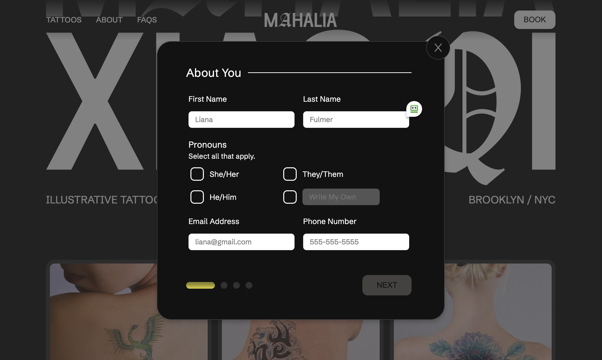
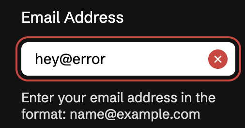
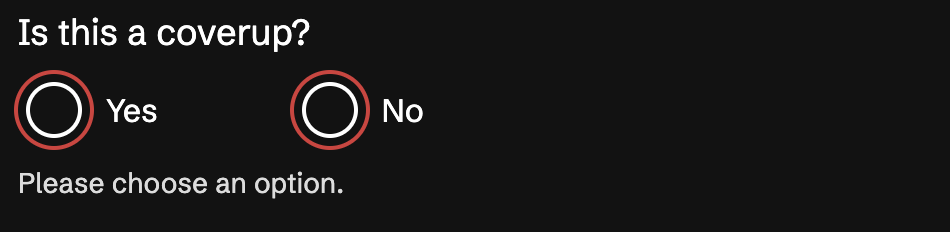
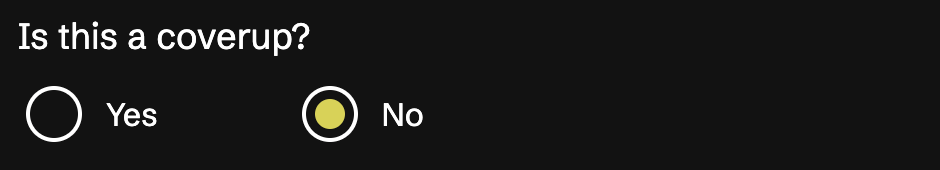
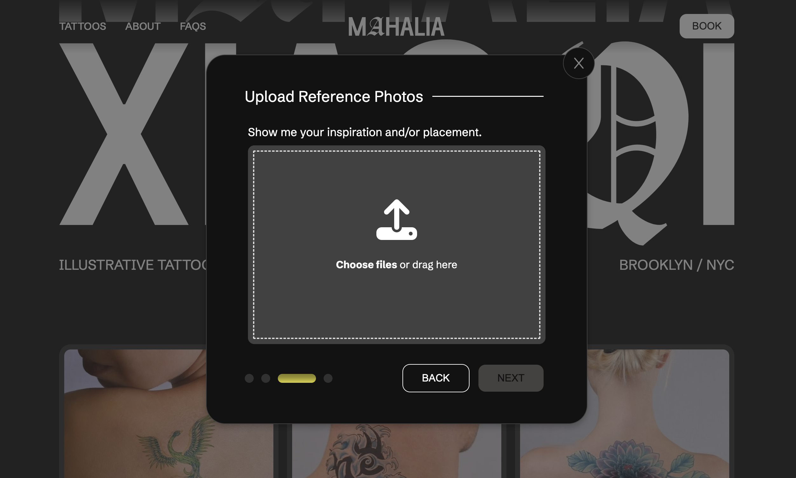
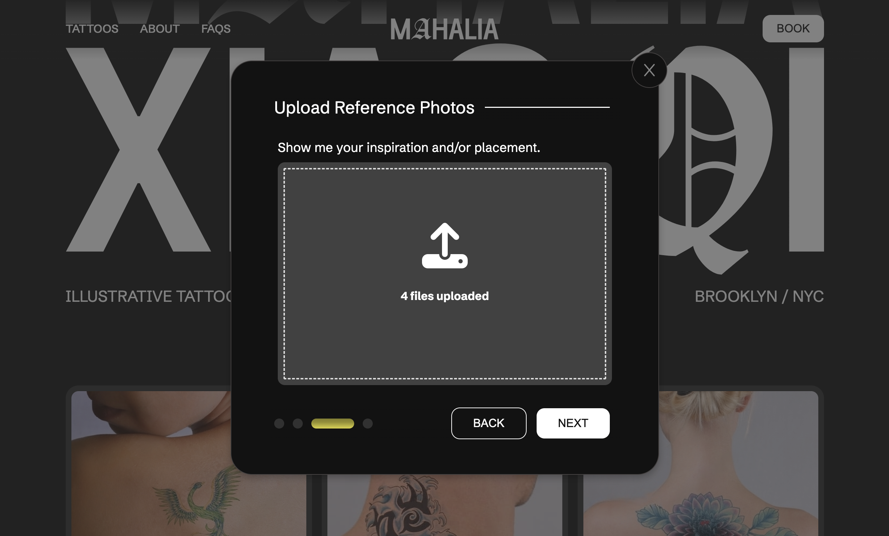
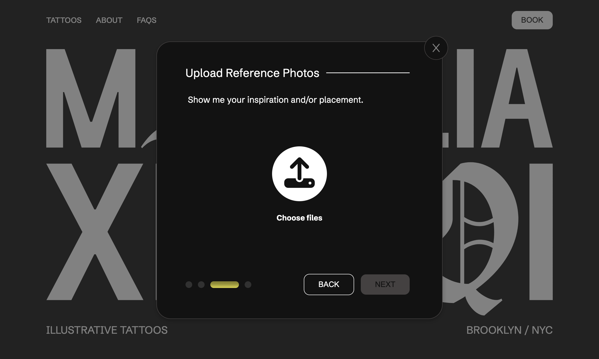
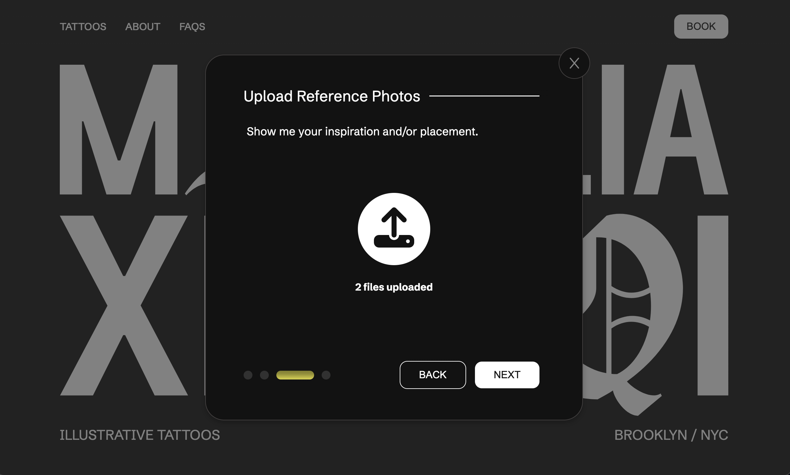

# Mahalia Xiaoqi Tattoos
[View the demo](https://animated-biscochitos-eac96f.netlify.app)

I spearheaded the design and development of a bite-size tattoo portfolio aimed at attracting clients for an emerging artist. This single-page site leverages modals to handle consultation booking requests and provide a traditional site feel. This website is built with HTML, CSS, and JavaScript.

Please note that as this website is still undergoing, it contains some stock photos and incomplete copy.

## Design Decisions
I previously led UX research and design efforts that influenced the styling of this site. For an in-depth understanding of the UX behind this site, [refer to this case study](https://brittshook.com/design/tattoo-portfolio)

## Features
### Landing Page
The site is designed to ensure responsiveness, with careful attention to styling across various viewport widths and heights for mobile, tablet, and desktop devices. Flexboxes and grids are utilized often to make this possible.

### Booking Form
This form is utilized by customers interested in booking a consultation and is structured as a multi-page form. Due to offloading the form backend to an external service, maintaining a singular form styled as multiple "pages" was crucial to minimize costs. For this reason, I implemented additional input validations before allowing users to navigate to subsequent pages of the form.

### Form Validation Examples
This form is styled to edge users towards a smooth experience. For example, the next page button appears disabled until a user completes the required fields on the page, and in the scenario that a user clicks the disabled next page button, the incomplete field(s) will automatically trigger their error UI and wiggle to call attention the field(s). 

Additionally, error/success UI is triggered after a change event (rather than input), to provide feedback to the user without impeding their experience. 

Screenshots of sample success and error form UIs:

### File Drag and Drop
In the interest of providing a seamless and intuitive user experience, I introduced file drag and drop functionality alongside traditional file selection. The UI gracefully adapts on browsers where this functionality is not supported.

